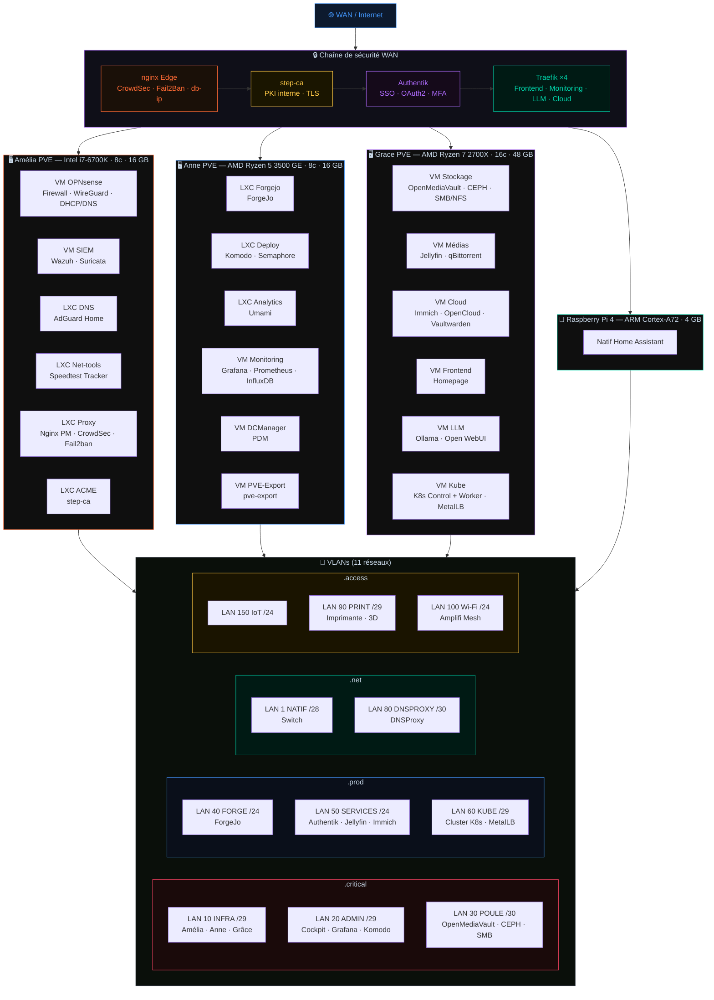

```mermaid
graph TD
    WAN["🌐 WAN / Internet"]

    subgraph SEC["🔒 Chaîne de sécurité WAN"]
        direction LR
        NGINX["nginx Edge\nCrowdSec · Fail2Ban · db-ip"]
        ACME["step-ca\nPKI interne · TLS"]
        SSO["Authentik\nSSO · OAuth2 · MFA"]
        TRAEFIK["Traefik ×4\nFrontend · Monitoring · LLM · Cloud"]
        NGINX --> ACME --> SSO --> TRAEFIK
    end

    WAN --> SEC

    subgraph AMELIA["🖥 Amélia PVE — Intel i7-6700K · 8c · 16 GB"]
        VM_OPN["VM OPNsense\nFirewall · WireGuard · DHCP/DNS"]
        VM_SIEM["VM SIEM\nWazuh · Suricata"]
        LXC_DNS["LXC DNS\nAdGuard Home"]
        LXC_NET["LXC Net-tools\nSpeedtest Tracker"]
        LXC_PRX["LXC Proxy\nNginx PM · CrowdSec · Fail2ban"]
        LXC_PKI["LXC ACME\nstep-ca"]
    end

    subgraph ANNE["🖥 Anne PVE — AMD Ryzen 5 3500 GE · 8c · 16 GB"]
        LXC_GIT["LXC Forgejo\nForgeJo"]
        LXC_DEP["LXC Deploy\nKomodo · Semaphore"]
        LXC_ANA["LXC Analytics\nUmami"]
        VM_MON["VM Monitoring\nGrafana · Prometheus · InfluxDB"]
        VM_DC["VM DCManager\nPDM"]
        VM_EXP["VM PVE-Export\npve-export"]
    end

    subgraph GRACE["🖥 Grace PVE — AMD Ryzen 7 2700X · 16c · 48 GB"]
        VM_STK["VM Stockage\nOpenMediaVault · CEPH · SMB/NFS"]
        VM_MED["VM Médias\nJellyfin · qBittorrent"]
        VM_CLD["VM Cloud\nImmich · OpenCloud · Vaultwarden"]
        VM_FRT["VM Frontend\nHomepage"]
        VM_LLM["VM LLM\nOllama · Open WebUI"]
        VM_K8S["VM Kube\nK8s Control + Worker · MetalLB"]
    end

    subgraph RPI["🍓 Raspberry Pi 4 — ARM Cortex-A72 · 4 GB"]
        NAT_HA["Natif Home Assistant"]
    end

    SEC --> AMELIA
    SEC --> ANNE
    SEC --> GRACE
    SEC --> RPI

    subgraph LAN["🔀 VLANs (11 réseaux)"]
        direction LR
        subgraph CRIT[".critical"]
            V10["LAN 10 INFRA /29\nAmélia · Anne · Grâce"]
            V20["LAN 20 ADMIN /29\nCockpit · Grafana · Komodo"]
            V30["LAN 30 POULE /30\nOpenMediaVault · CEPH · SMB"]
        end
        subgraph PROD[".prod"]
            V40["LAN 40 FORGE /24\nForgeJo"]
            V50["LAN 50 SERVICES /24\nAuthentik · Jellyfin · Immich"]
            V60["LAN 60 KUBE /29\nCluster K8s · MetalLB"]
        end
        subgraph NET[".net"]
            V1["LAN 1 NATIF /28\nSwitch"]
            V80["LAN 80 DNSPROXY /30\nDNSProxy"]
        end
        subgraph ACCESS[".access"]
            V150["LAN 150 IoT /24"]
            V90["LAN 90 PRINT /29\nImprimante · 3D"]
            V100["LAN 100 Wi-Fi /24\nAmplifi Mesh"]
        end
    end

    AMELIA --> LAN
    ANNE --> LAN
    GRACE --> LAN
    RPI --> LAN

    style WAN fill:#0d1a2e,stroke:#4499ff,color:#4499ff
    style SEC fill:#0f0f18,stroke:#b06cff,color:#c8d8e8
    style NGINX fill:#1a1008,stroke:#ff6b35,color:#ff6b35
    style ACME fill:#1a1500,stroke:#ffc947,color:#ffc947
    style SSO fill:#150a1a,stroke:#b06cff,color:#b06cff
    style TRAEFIK fill:#001a14,stroke:#00d4aa,color:#00d4aa
    style AMELIA fill:#0f0f0f,stroke:#ff6b35,color:#c8d8e8
    style ANNE fill:#0f0f0f,stroke:#4499ff,color:#c8d8e8
    style GRACE fill:#0f0f0f,stroke:#b06cff,color:#c8d8e8
    style RPI fill:#0f0f0f,stroke:#00d4aa,color:#c8d8e8
    style LAN fill:#0a0f0a,stroke:#1e2530,color:#c8d8e8
    style CRIT fill:#1a0a0a,stroke:#ff4466,color:#c8d8e8
    style PROD fill:#0a0f1a,stroke:#4499ff,color:#c8d8e8
    style NET fill:#001a14,stroke:#00d4aa,color:#c8d8e8
    style ACCESS fill:#1a1400,stroke:#ffc947,color:#c8d8e8
```