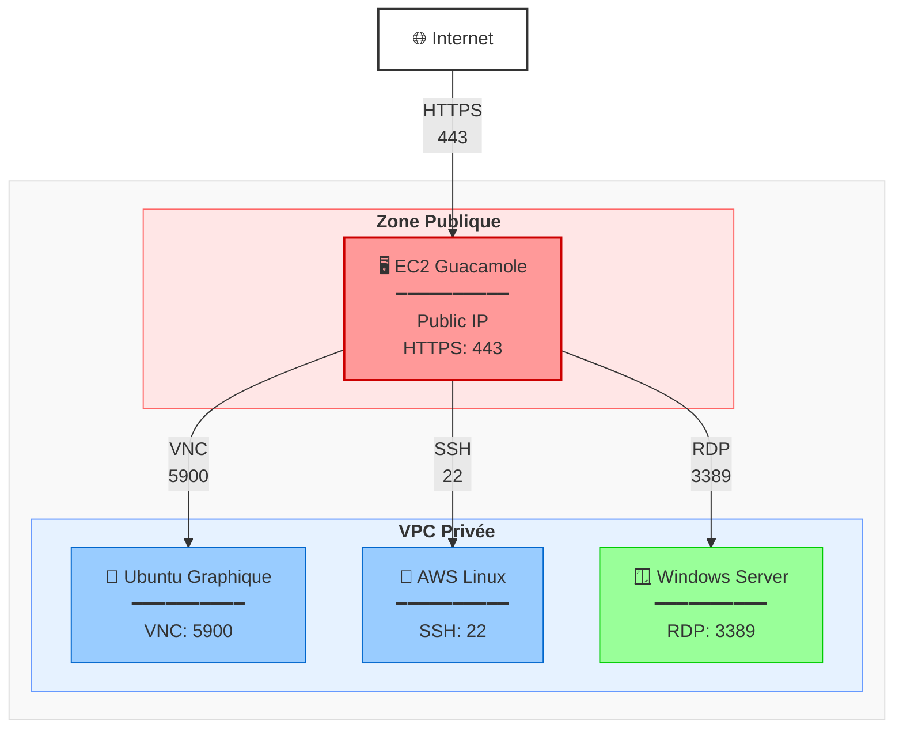

# Bastion graphique Guacamole

## But recherché

Réalisation d'un bastion graphique sur AWS, accessible via HTTPS et permettant de se connecter en RDC/VNC/SSH à des instances Windows ou Linux sur réseau privé.

### Architecture finale:



## Concepts et définitions

### Guacamole

**Bastion graphique** (remote desktop gateway) permettant d'accéder via un navigateur web à des serveurs Linux/Windows en VNC/RDP/SSH. Déployé sur EC2 publique, il sert de proxy sécurisé pour accéder aux instances privées du VPC.

- **Protocoles supportés** : VNC, RDP, SSH, ...
- **Accès** : HTTPS:443 depuis internet
- **Rôle** : Bastion/Jump host graphique

### AMI (*Amazon Machine Image*)

Modèle préconfigué d'une instance EC2 contenant le système d'exploitation et les applications.

## Mise en place

### Security Groups

Après avoir selectionné son [VPC](vpc.md), on va créer les Security Groups :


#### SG principal : Guacamole Server

| Règle | Type | Protocole | Port | Source | Description |
|-------|------|-----------|------|--------|-------------|
| Inbound | HTTPS | TCP | 443 | 0.0.0.0/0 | Accès web Guacamole |
| Inbound | HTTP | TCP | 80 | 0.0.0.0/0 | Redirection vers HTTPS (optionnel) |
| Outbound | All traffic | All | All | 0.0.0.0/0 | Accès sortant vers les cibles |


#### SG cible : Windows (RDP)

| Règle | Type | Protocole | Port | Source | Description |
|-------|------|-----------|------|--------|-------------|
| Inbound | RDP | TCP | 3389 | sg-guacamole | RDP depuis Guacamole uniquement |
| Outbound | All traffic | All | All | 0.0.0.0/0 | Sortant libre |

!!! tip "Source"

    La source est le Security Group ID du serveur Guacamole, pas une plage IP.


#### SG cible : GNU/Linux (VNC)

| Règle | Type | Protocole | Port | Source | Description |
|-------|------|-----------|------|--------|-------------|
| Inbound | Custom TCP | TCP | 5900 | sg-guacamole | VNC display :0 depuis Guacamole |
| Inbound | Custom TCP | TCP | 5901 | sg-guacamole | VNC display :1 (multi-session) |
| Outbound | All traffic | All | All | 0.0.0.0/0 | Sortant libre |


#### SG cible : GNU/Linux (SSH)

| Règle | Type | Protocole | Port | Source | Description |
|-------|------|-----------|------|--------|-------------|
| Inbound | SSH | TCP | 22 | sg-guacamole | SSH depuis Guacamole uniquement |
| Outbound | All traffic | All | All | 0.0.0.0/0 | Sortant libre |

### Récapitulatif des flux

```text
Internet
   │ HTTPS:443
   ▼
[Guacamole SG]
   │ TCP:3389  ──────► [SG Windows]
   │ TCP:5900  ──────► [SG Ubuntu]
   └ TCP:22    ──────► [SG Amazon Linux]
```

Les SGs des machines cibles n'autorisent aucun accès direct depuis Internet. Tout transite par Guacamole, qui joue le rôle de bastion managé.

### Création des EC2

On crée alors, au minimum, [2 instances EC2](spin_instance.md) : le guacamole, et la machine cible.
