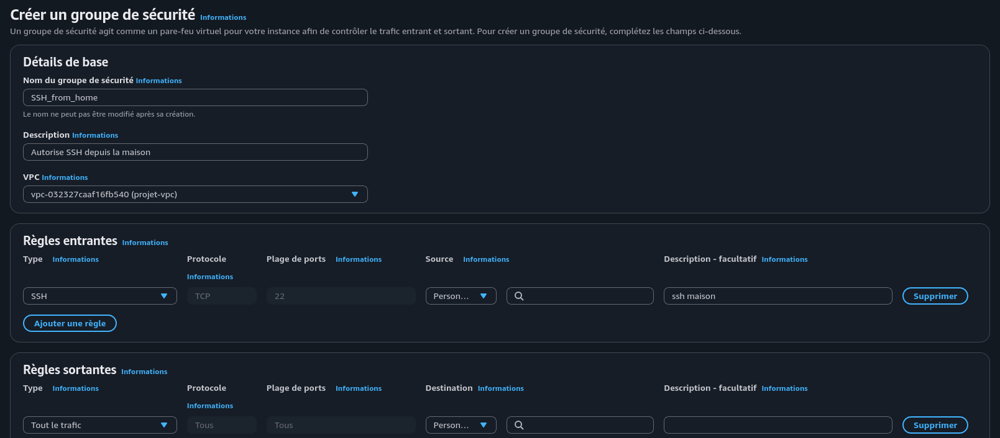
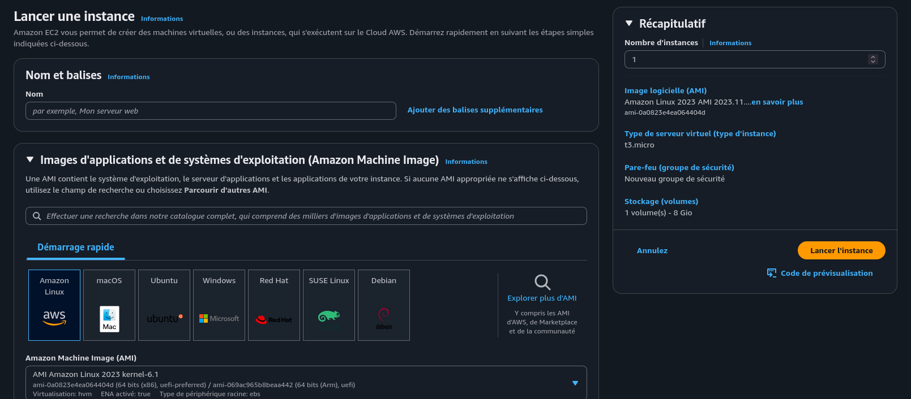

# Créer et configurer des instances EC2 sur AWS

## Introduction

L'une des plus grande force d'AWS est son offre de serveurs cloud à la demande, entièrement automatisée et facturés à l'usage : EC2 (Elastic Compute Cloud)

## Définitions

### Instance
Serveur virtuel en exécution créé à partir d'une AMI. Chaque instance possède une configuration (type, CPU, RAM, stockage) et peut être accessible via une adresse IP publique ou privée.

### Type d'instance
Catégorie déterminant les ressources allouées (CPU, RAM, réseau). Exemples : t3.micro (gratuit), t3.small, m5.large (usage général), c5.xlarge (calcul intensif).

### AMI (Amazon Machine Image)
Modèle préconfigué contenant le système d'exploitation, les dépendances et les applications. Sert de base pour créer des instances identiques.

### VPC (Virtual Private Cloud)
Réseau virtuel privé dans lequel les instances sont déployées. Permet de segmenter et contrôler le trafic réseau.

### Security Group
Pare-feu virtuel contrôlant les règles d'entrée/sortie des instances. Définit quels ports et protocoles sont accessibles.

### Paire de clés
Paire cryptographique (publique/privée) permettant l'authentification SSH vers l'instance. La clé privée doit être conservée en sécurité.

## Créer les Security Groups

Un bonne pratique est de configurer les SG *avant* la création des instances, puis de leur assigner les SG créés précédemment.
On va donc dans **EC2 > Réseau et sécurité > Groupes de sécurité** pour en créer un premier qui permettra à *NOTRE* IP, et uniquement la notre, de se connecter, en SSH.

On assigne un nom clair, une description, et on lui rattache le VPC.



Pour SSH, on va selectionner dans les *Règles Entrantes* SSH, qui va préshot le port 22 par défaut. Dans la liste des *Sources*, on selectionne `Mon IP` et on ajoute une description.

C'est tout ! On peut ajouter une balise au besoin, sinon on peut créer le SG.

## Créer une EC2

### Configurer l'instance

On navigue dans le menu **EC2 > Instances > Lancer une instance**, qui nous ouvre une interface de configuration.



!!! question "Bonnes pratiques"

    Le premier encart est dédié aux noms et balises. Il est recommandé de nommer les instances de manière claire et structurée, en utilisant des balises pour faciliter la gestion et l'organisation des ressources.

!!! example "Nombre d'instances"

    Sur le côté droit, on peut régler le nombre d'instances, ayant la même configuration, à lancer en même temps.

### Choix de la distribution

Chaque distribution a son prix, il faut donc choisir en fonction de ses affinités, de ses besoins, mais aussi des coûts.

Amazon Linux est une distribution de la famille Red-Hat (RHEL) et est généralement la moins chère.

### Type d'instance

t3.micro et t3.small sont éligibles à l'offre gratuite. 

Chaque machine a son prix, sa configuration. Voici les principales familles d'instances :

- General Purpose (t, m) — usage équilibré. Les t sont burstables (crédit CPU), les m ont des ressources fixes. Bon pour du web, des applis standard.
  
- Compute Optimized (c) — ratio CPU élevé, peu de RAM. Idéal pour du calcul intensif, encodage vidéo, batch processing.
  
- Memory Optimized (r, x, z) — grosse RAM. Pour les bases de données in-memory (Redis, SAP HANA), le traitement de gros datasets.
  
- Storage Optimized (i, d, h) — NVMe local 
haute vitesse ou dense HDD. Pour les bases de données NoSQL, data warehouses, systèmes de fichiers distribués.

- Accelerated Computing (p, g, inf, trn) — GPU ou accélérateurs dédiés. p/g pour le ML/deep learning et le rendu, inf/trn pour l'inférence et l'entraînement de modèles Neuron (AWS).
  
- HPC (hpc) — réseau ultra-faible latence (EFA), pour la simulation scientifique et les workloads MPI.

### Paire de clés

On crée (ou si déjà fait, on la selectionne) une paire de clef.

On lui donne un nom, et on choisi un protocole de chiffrement. ED25519 est plus récent et robuste, mais non compatible avec d'anciennes machines. Enfin, le format (.pem sous Linux) permet d'enregistrer la clef pour se connecter, en toute légitimité, à l'instance.

!!! warning "Clé d'authentification"

    Cette paire de clef permet de s'authentifier sur le serveur créé. Sans la clé, pas de connexion. On télécharge donc la clé générée, et on la met dans un endroit accessible.

### Paramètres réseau


### Se connecter

On remplace $IP par l'IP *publique* de l'instance EC2 et $USER par le nom d'utilisateur par défaut de la distribution.
Le `key_pair.pem` est la clef privée récupérée plus haut.

```sh
ssh -i /path/key_pair.pem $USER@$IP
```
> Pour Windows, le mot de passe initial est récupérable via **EC2 > Instances > Get Windows Password** avec la clé privée `.pem`.

    !!! info

        === "Linux"
        
        `ec2-user`, `root` ou le nom de la distribution (`ubuntu`, ...)

        === "Windows"

        `Administrator` sauf si connecté à un AD


