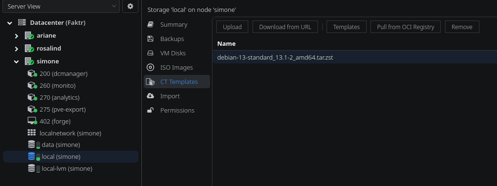
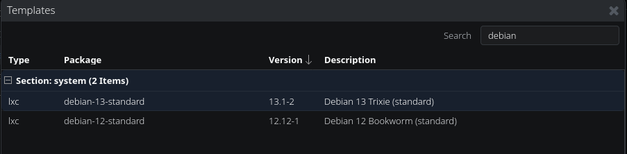
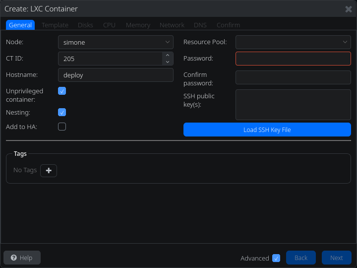

# Introduction

# Créer une LXC

## Télécharger une image

Sous proxmox, on commence par selectionner un stockage compatible (par exemple : local) sur le node où l'on va créer la LXC. Ensuite, on choisi par quel méthode on veut télécharger l'image. Pour une première LXC, Debian 13 est un bon choix et présent dans les templates de base.

Une fois téléchargé, on peut créer une LXC.

# Créer une CT

En haut à droit, `Créer CT` et on arrive sur un formulaire :

!!! tip "Conventions et bonnes pratiques"

    Avec la multiplication des machines virtuelles et conteneurs, il est prudent de leur assigner un nom clair qui identifie sa fonction directemement au sein de proxmox. En outre, son nom dans PVE sera aussi son nom sur le réseau.

    !!! note "Exemple ici"

        Pour les IDs, j'utilise les vlans et IP, personnellement. Exemple : `deploy` sur `vlan20`, IP en `0.5` ce qui donne : `Deploy : 205`.

On choisi toujours `Unprivileged`, sauf si besoin d'un passtrought. Un conteneur privilégié à accès à tous les périphériques de l'hôte, cassant en partie l'isolation d'une LXC.

`Nesting` est nécéssaire si on souhaite faire du docker, des lxc ou manipuler de la virtualisation dans le conteneur, ce qui est souvent le cas chez moi.

`Add to HA` permet, si le stockage de la LXC est installée sur un stockage réseau, de relancer automatiquement la LXC sur une autre machine physique en cas de coupure de la première.

Enfin, les clefs SSH, ainsi que le mot de passe root.

!!! warning "Bonnes pratiques"

    Même si un mot de passe long seul peut sembler adéquat, je ne peux qu'encourager l'utilisation d'une clef SSH personelle. Mieux, si on possède un bastion, la clef publique de ce *relay ssh* sera la meilleure pratique.

Les pages suivantes sont assez intuitives, et les options par défaut sont, souvent, le choix le plus judicieux.

Dans la partie réseau, attention à renseigner le Vlan et une IP au besoin. Les IP se mettent au format CIDR (Exemple: 192.168.0.1/24).

Enfin, on vérifie et on confirme la création de la LXC. Après quelques dizaines de secondes elle devrait être configurée et apparaitre avec les autres machines sur Proxmox.

## Configuration de Debian

!!! warning "Bonnes pratiques"

    Debian est installé, mais tout nu. On pense à configurer ça proprement. Un guide est disponible sur la page [configuration d'une VM](serverconfig.md).